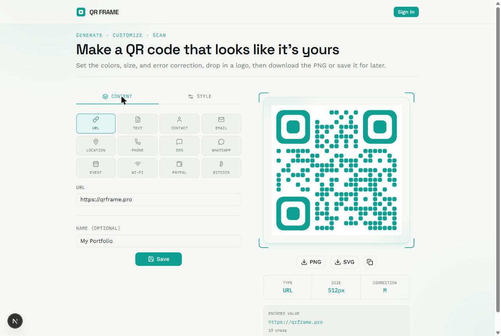
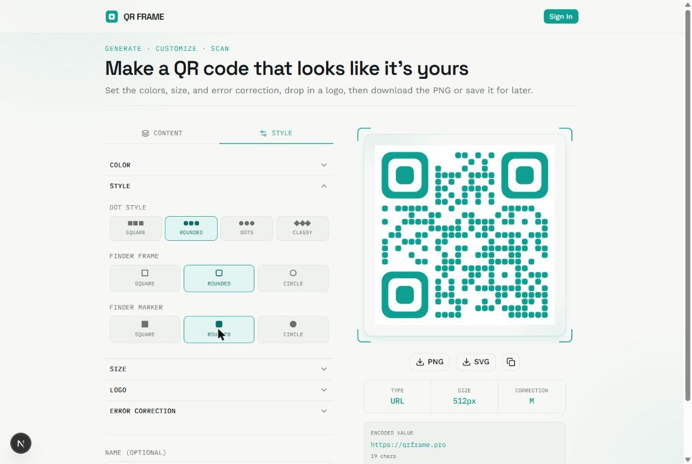

<div align="center">

# 🔳 QRFrame

**A QR code generator that looks like it's yours.**

Pick a content type, style every pixel, download it as PNG or SVG — and save it for later once signed in.

[](./LICENSE)
[](https://nextjs.org/)
[](https://www.typescriptlang.org/)
[](https://react.dev/)
[](https://www.prisma.io/)
[](https://clerk.com/)
[](https://tailwindcss.com/)
[](https://pnpm.io/)
[](https://github.com/yanfishel/qr-code-generator/pulls)

</div>

<p align="center">
  
</p>

## Contents

- [Features](#features)
- [Screenshots](#screenshots)
- [Tech stack](#tech-stack)
- [Getting started](#getting-started)
- [Commands](#commands)
- [Project structure](#project-structure)
- [QR content model](#qr-content-model)
- [Testing](#testing)
- [License](#license)

## Features

- 🧩 **12 content types** — URL, text, email, Wi-Fi, contact (vCard), SMS, phone, location, Bitcoin, WhatsApp, calendar event, PayPal.
- 🎨 **Full style customization** — foreground/background color (with transparency), four dot styles, independent finder frame/marker shapes, size, error-correction level, margin, and a centered logo overlay.
- ⬇️ **PNG/SVG export** — download the generated code in either format, pixel-identical between the two renderers.
- 💾 **Saved codes** — signed-in users can save codes, edit them later, and share a permanent public link at `/code/[id]`; the generator and downloads themselves stay public.
- 🔒 **Frictionless auth** — hit Save while signed out and QRFrame opens a sign-in modal, then retries your save automatically once you're in — no lost work, no redirect roundtrip.

## Screenshots

<table>
  <tr>
    <td width="50%">
      
      <p align="center"><sub>Pick a content type and preview the QR code live</sub></p>
    </td>
    <td width="50%">
      
      <p align="center"><sub>Customize colors, dot shapes, and finder patterns</sub></p>
    </td>
  </tr>
</table>

## Tech stack

| Layer | Choice |
| --- | --- |
| Framework | [Next.js](https://nextjs.org/) (App Router) + TypeScript |
| UI | Tailwind CSS + [shadcn/ui](https://ui.shadcn.com/) (Radix UI) |
| QR rendering | In-house canvas/SVG renderer on top of [`qrcode`](https://github.com/soldair/node-qrcode)'s bit-matrix |
| Database | [Prisma 6](https://www.prisma.io/) (MySQL) |
| Auth | [Clerk](https://clerk.com/) |
| Package manager | pnpm |
| Testing | Vitest + React Testing Library |

## Getting started

### Prerequisites

- Node.js 20+
- pnpm
- A MySQL database reachable from your machine (plus a second, empty database used only as Prisma's [shadow database](https://www.prisma.io/docs/orm/prisma-migrate/understanding-prisma-migrate/shadow-database))
- A [Clerk](https://clerk.com/) application (for sign-in)

### Setup

```bash
pnpm install
```

Create a `.env` file with:

```bash
DATABASE_URL="mysql://..."          # main database, migrations already applied
SHADOW_DATABASE_URL="mysql://..."   # empty database, used only by `prisma migrate dev`
NEXT_PUBLIC_CLERK_PUBLISHABLE_KEY="..."
CLERK_SECRET_KEY="..."
```

> [!IMPORTANT]
> The database user for `DATABASE_URL` can't create databases itself, so `prisma migrate dev` needs `SHADOW_DATABASE_URL` to diff migrations against. Without it, `pnpm db:migrate` fails with error `P3014`.

Run the app:

```bash
pnpm dev
```

The app is now available at [http://localhost:3000](http://localhost:3000).

## Commands

| Command | Purpose |
| --- | --- |
| `pnpm dev` | Start the dev server (Turbopack) |
| `pnpm build` / `pnpm start` | Production build / start |
| `pnpm lint` | Run ESLint |
| `pnpm test` | Run the Vitest suite once |
| `pnpm test:watch` | Run tests in watch mode |
| `pnpm db:migrate` | Run Prisma migrations (`prisma migrate dev`) |
| `pnpm db:studio` | Open Prisma Studio |

## Project structure

```
src/
  actions/       Server actions ("use server") — the only entry point to Prisma from client components
  app/           App Router pages: / (generator), /saved, /code/[id] (public share), /sign-in, /sign-up
  components/
    qr/          QR generator UI: form, canvas/SVG renderers, type selector, style controls
    ui/          shadcn/ui components (Radix UI, "nova" preset)
  hooks/         use-qr-download — PNG/SVG download logic
  lib/           qr-schema.ts (content model), qr-render.ts (layout geometry), current-user.ts, prisma.ts
  proxy.ts       Clerk route matching
prisma/
  schema.prisma, migrations/
```

## QR content model

`src/lib/qr-schema.ts` is the source of truth for what a QR code can encode:

- `qrTypes` — the list of supported content types, mirrored by a `QrType` enum in `prisma/schema.prisma`.
- `QrFieldValues` — the raw per-type input shape (e.g. SSID/password for Wi-Fi, address for a vCard).
- `buildQrValue(type, fields)` — encodes those inputs into the final string that gets persisted as `QrCode.data` (e.g. `WIFI:T:...;;`, `mailto:...`, a vCard or `BEGIN:VCALENDAR` block).
- `parseQrValue(type, data)` — the best-effort inverse, used to pre-fill the edit form from a persisted code.

Content fields (per type) and style fields (name, colors, dot style, finder style, size, error-correction level, margin, logo) are validated separately: only the derived string plus style fields go through `qrFormSchema` before being persisted.

## Testing

```bash
pnpm test
```

Vitest + React Testing Library, jsdom environment. QR-rendering coverage lives in `src/lib/__tests__/qr-render.test.ts` (pure layout geometry) and `QrSvg.test.tsx` (real SVG markup) since jsdom's canvas has no backend to draw into.

> [!NOTE]
> For a deeper dive into architecture, the design system, and repository conventions, see [CLAUDE.md](./CLAUDE.md).

## License

[MIT](./LICENSE) © Yan Fishel
